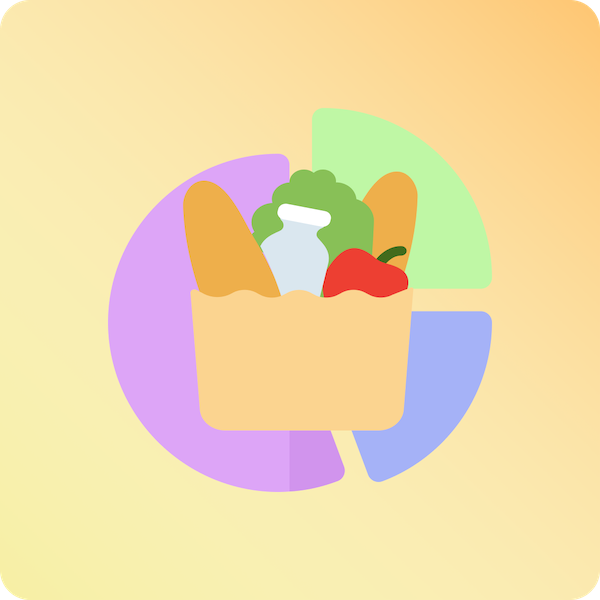

<h1> eschoppe </h1>

A nice, convenient shopping list tracker for personal use and more...

## General Strucure / Idea

Refer to [the project general structure](./docs/structure.md)

## Tech-Stack

>  
>  
>  
>  
> 

For reasoning, refer to [why this docs](./docs/why_tf_this.md)

## Contributing

At the moment, I am not really that open as I want to have me do most of the work, but I am open to changing this in the future. If so, refer to [contribution guidelines](./docs/how_tf_i_contribute.md)

This project is licensed under Apache License Version 2.0  
The icons and imagery is licensed [here](./web/public/icons/license.pdf)
